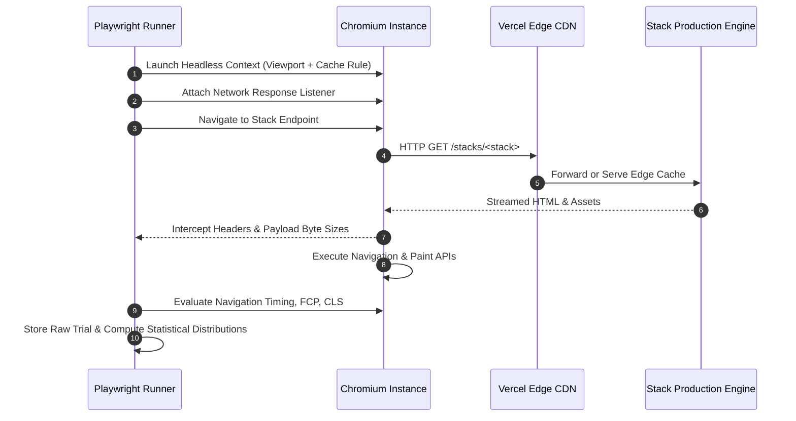

# BENCHMARK HARNESS ARCHITECTURE

```mermaid
sequenceDiagram
  autonumber
  participant Harness as Playwright Runner
  participant Browser as Chromium Instance
  participant Vercel as Vercel Edge CDN
  participant Server as Stack Production Engine

  Harness->>Browser: Launch Headless Context (Viewport + Cache Rule)
  Harness->>Browser: Attach Network Response Listener
  Harness->>Browser: Navigate to Stack Endpoint
  Browser->>Vercel: HTTP GET /stacks/<stack>
  Vercel->>Server: Forward or Serve Edge Cache
  Server-->>Browser: Streamed HTML & Assets
  Browser-->>Harness: Intercept Headers & Payload Byte Sizes
  Browser->>Browser: Execute Navigation & Paint APIs
  Harness->>Browser: Evaluate Navigation Timing, FCP, CLS
  Harness->>Harness: Store Raw Trial & Compute Statistical Distributions
```
